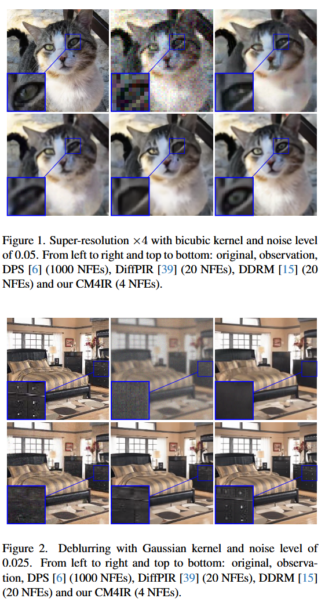

# Zero-Shot Image Restoration Using Few-Step Guidance of Consistency Models (and Beyond)

## 📖[**Paper**](https://arxiv.org/abs/2412.20596.pdf) (CVPR 2025)

[Tomer Garber](https://scholar.google.com/citations?user=-ZciND8AAAAJ), [Tom Tirer](https://scholar.google.com/citations?user=_6bZV20AAAAJ)

Bar-Ilan University

# Introduction

This repository contains the code release for *Zero-Shot Image Restoration Using Few-Step Guidance of Consistency Models (and Beyond)* [***CM4IR***].

## Supported degradations

1. Super-Resolution (Bicubic)
2. Gaussian Deblurring
3. Inpainting

# Setup

## Installation

### Clone this repository

To clone this repository and the code, run:

```bash
git clone https://github.com/tirer-lab/CM4IR.git
```

### Environment

There are several dependencies required, and you may install it via *pip* or *Docker*.
The code was written and tested on Python 3.8 and PyTorch 1.9.0.

#### Pip

```bash
pip install -r requirements.txt
```

For hardware specific packages, such as torch, install the relevant versions according to your setup, for example:

```bash
pip install torch==1.9.0+cu111 torchvision==0.10.1+cu111 -f https://download.pytorch.org/whl/torch_stable.html
```

#### Docker

The repository contains [Dockerfile](Dockerfile), in order to use it run (after cloning this repo and `cd` to it):

```bash
docker build .
```

## Pre-Trained Models
We used the official pre-trained Consistency Models provided by OpenAI in the [CM repo](https://github.com/openai/consistency_models?tab=readme-ov-file#pre-trained-models).

To set the models used in the paper:

### LSUN Bedroom
The LSUN Bedroom 256x256 model checkpoint can be
found [here](https://openaipublic.blob.core.windows.net/consistency/cd_bedroom256_lpips.pt).
Download it and place it in `CM4IR/exp/logs/lsun_bedroom/`.

### LSUN Cat
The LSUN Cat 256x256 model checkpoint can be
found [here](https://openaipublic.blob.core.windows.net/consistency/cd_cat256_lpips.pt).
Download it and place it in `CM4IR/exp/logs/lsun_cat/`.

### ImageNet
The ImageNet 64x64 model checkpoint can be
found [here](https://openaipublic.blob.core.windows.net/consistency/cd_imagenet64_lpips.pt).
Download it and place it in `CM4IR/exp/logs/imagenet/`.

## Quick Start
Run the following commands to get immediate CM4IR results:

1. LSUN Cat SRx4 with sigma_y=0.05:
    ```bash
    python main.py --config lsun_cat_256.yml --path_y lsun_cat --deg sr_bicubic --deg_scale 4 \
   --sigma_y 0.05 -i CM4IR_lsun_cat_sr_bicubic_sigma_y_0.05 --iN 250 --gamma 0.2 \
   --model_ckpt lsun_cat/cd_cat256_lpips.pt
    ```

2. LSUN Bedroom Gaussian deblurring with sigma_y=0.025:
    ```bash
    python main.py --config lsun_bedroom_256.yml --path_y lsun_bedroom --deg deblur_gauss --sigma_y 0.025 \
    -i CM4IR_lsun_bedroom_deblur_gauss_sigma_y_0.025 --iN 75 --gamma 0.01 --zeta 3 \
   --model_ckpt lsun_bedroom/cd_bedroom256_lpips.pt
    ```
3. ImageNet 64 SRx2 with sigma_y=0.01:
    ```bash
    python main.py --config imagenet_64_cc.yml --path_y imagenet --deg sr_bicubic --deg_scale 2 \
   --sigma_y 0.01 -i CM4IR_imagenet_sr_bicubic_sigma_y_0.01 --iN 50 --gamma 0.01 \
   --model_ckpt imagenet/cd_imagenet64_lpips.pt
    ```

The results will be in `CM4IR/exp/image_samples/`.
## Full Datasets

The datasets used in the paper are LSUN bedroom, LSUN cat and ImageNet.
### LSUN
Both LSUN Bedroom and LSUN Cat validation sets used in the paper can be found [here](https://drive.google.com/drive/folders/1umSbW_91LTJuK11Il_pmleC4OPei7LAE?usp=sharing).
Additionally, the datasets can be downloaded from source:

#### LSUN Bedroom
The LSUN Bedroom dataset can be downloaded using the official download code in [this repository](https://github.com/fyu/lsun).

#### LSUN Cat
The LSUN Cat dataset can't be downloaded with the script mentioned above, but it can be found [here](http://dl.yf.io/lsun/objects/).
We used the last 300 images as validation set.

### ImageNet
ImageNet can be found in: 
[[Google drive](https://drive.google.com/drive/folders/1cSCTaBtnL7OIKXT4SVME88Vtk4uDd_u4?usp=sharing)] [[Baidu drive](https://pan.baidu.com/s/1tQaWBqIhE671v3rrB-Z2mQ?pwd=twq0)].

---
After you download the datasets, place each dataset in the relevant directory:

1. LSUN Bedroom - Place the dataset in `CM4IR/exp/datasets/lsun_bedroom`
2. LSUN Cat - Place the dataset in `CM4IR/exp/datasets/lsun_cat`
3. ImageNet - Place the dataset in `CM4IR/exp/datasets/imagenet/`.
   1. Download the file `imagenet_val_1k.txt` from the links above as well, and place it in `CM4IR/exp`. Rename this file to `imagenet_val.txt` in order for the code to use it.


## Parameters

The general python command to run the code is:
```
python main.py --config {config}.yml --path_y {dataset_folder} --deg {deg} --sigma_y {sigma_y}
-i {image_folder} --iN {iN} --gamma {gamma} --zeta {zeta} --eta {eta} --operator_imp {operator_implementation} 
--deltas {deltas} --save_y {save_observation}
```

Where:

- `config`: The name of the yml to use to configure the model used.
- `model_ckpt`: Name of the model ckpt file in exp/logs. The model should be in `exp/logs/<model_ckpt>`. For example: `lsun_bedroom/cd_bedroom256_lpips.pt`.
- `dataset_folder`: The name of the directory containing the image dataset.
- `deg`: the degradation type to use. Used in paper: `sr_bicubic`, `deblur_gauss`, `inpainting`
    - When using `sr_bicubic`, the flag `--deg_scale` is also required
    - When using `inpainting`, the flag `--inpainting_mask_path` is also required
- `sigma_y`: Noise level. Noise levels used in paper: `0, 0.01, 0.025, 0.05`.
- `image_folder`: Name of directory for output images.
- `iN`: The iN hyperparameter used in the paper.
- `gamma`: The Gamma hyperparameter used in the paper.
- `zeta`: The Zeta hyperparameter used in the paper.
- `eta`: The Eta hyperparameter used in the paper.
- `deltas`: The deltas hyperparameters used the in the paper. Should be a string of comma seperated values, for example: "0.1,0.2,0.3,0.4".
- `deltas_injection_type`: `0` to inject deltas to the boundary scaling as well, `1` to inject only to the model input.
- `operator_implementation` - Whether to use `SVD` or `FFT` operator implementations. Defaults to `SVD`.
- `save_observation` - Whether to save the observed image (`y`) or not. Defaults to `False`.


Additionally, you can configure the sampling steps (defaults to `4` in the paper). In each yml config under `configs` directory
(`imagenet_64_cc.yml`, `lsun_bedroom_256.yml` and `lsun_cat_256.yml`) you may change:
```yaml
sampling:
  T_sampling: <desired_sampling_steps>
```

## Evaluation

The [evaluate_CM4IR.sh](evaluate_CM4IR.sh) script can be used for reproducing paper results.


## Qualitative Results



Additional results can be found in the paper, including PSNR and LPIPS results compared to competitors.

## Citations
If you used this repository in your research, please cite the paper:
```
@inproceedings{garber2024zero,
  title={Zero-Shot Image Restoration Using Few-Step Guidance of Consistency Models (and Beyond)},
  author={Garber, Tomer and Tirer, Tom},
  booktitle={Proceedings of the IEEE/CVF conference on computer vision and pattern recognition},
  year={2025}
}
```

This implementation is inspired by https://github.com/tirer-lab/DDPG, https://github.com/openai/consistency_models and https://github.com/bahjat-kawar/ddrm.


